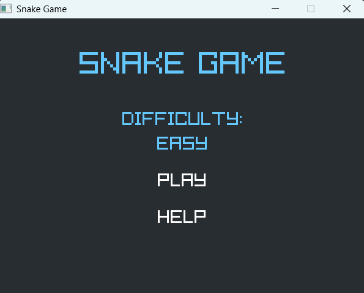
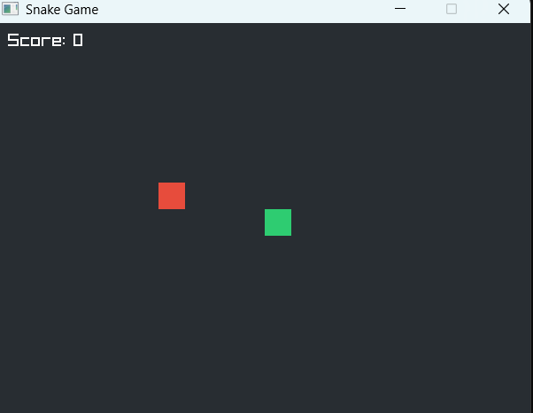

# Snake Game en C 🐍

Implémentation du jeu Snake en C avec la bibliothèque graphique Raylib, incluant un menu principal, plusieurs niveaux de difficulté, un écran d'aide et un son de fin de partie.

## ✨ Fonctionnalités

- **Menu principal** :
  - Sélection de la difficulté (Easy, Medium, Hard)
  - Lancer la partie
  - Accéder à l'écran d'aide
- **Gameplay** :
  - Déplacement du serpent avec les flèches
  - Fruits à manger pour augmenter le score et la longueur
  - Gestion des collisions :
    - Bords de la grille
    - Corps du serpent (auto-collision)
- **Écrans** :
  - Jeu
  - Game Over (rejouer ou retour menu)
  - Aide
- **Audio** :
  - Son de game over (`assets/gameover.wav`, avec chemins de secours si le fichier n'est pas trouvé)

## 🛠️ Technologies

- Langage C
- Raylib (graphique, input, audio)
- Organisation :
  - `main.c` : logique du jeu (états, entrée clavier, update, rendu)
  - `bin/Debug/` : exécutable Windows (`snakegame.exe`)
  - `assets/` : ressources audio

## 🚀 Compilation & exécution

### Exécutable existant (Windows)

- Lancer :  
  `bin/Debug/snakegame.exe`

### Compilation manuelle (exemple GCC)

Adapter selon ton installation Raylib / Windows :

```bash
gcc main.c -o snakegame -lraylib -lopengl32 -lgdi32 -lwinmm
./snakegame
```

> Sur Windows, s'assurer que les DLL de Raylib sont accessibles (dans le PATH ou dans le même dossier que l'exécutable).

## 🎮 Contrôles

- **Flèches** : déplacer le serpent
- **Entrée** : valider dans le menu
- **Échap** :
  - En jeu : retour au menu
  - Aide / Game Over : retour au menu
- **Espace** : rejouer depuis l'écran Game Over
## 📸 Captures d'écran

### 🏠 Écran d'accueil


### ingame


## 👤 Auteur

- **Nom** : Khawla Chaabi  
- **GitHub** : https://github.com/khawlachaabi


